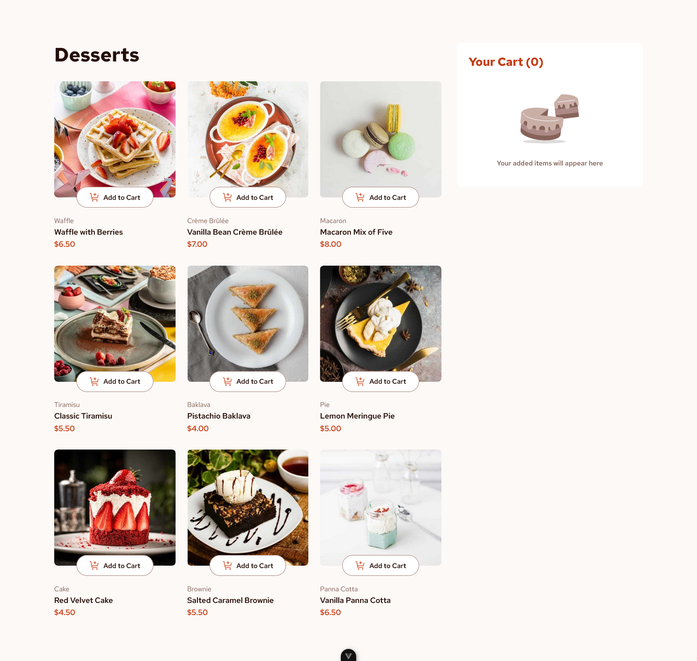

# Frontend Mentor - Product list with cart solution

This is a solution to the [Product list with cart challenge on Frontend Mentor](https://www.frontendmentor.io/challenges/product-list-with-cart-5MmqLVAp_d). Frontend Mentor challenges help you improve your coding skills by building realistic projects.

## Table of contents

-   [Overview](#overview)
    -   [The challenge](#the-challenge)
    -   [Screenshot](#screenshot)
    -   [Links](#links)
-   [My process](#my-process)
    -   [Built with](#built-with)
    -   [What I learned](#what-i-learned)
    -   [Continued development](#continued-development)
    -   [Useful resources](#useful-resources)
-   [Author](#author)

## Overview

### The challenge

Users should be able to:

-   Add items to the cart and remove them
-   Increase/decrease the number of items in the cart
-   See an order confirmation modal when they click "Confirm Order"
-   Reset their selections when they click "Start New Order"
-   View the optimal layout for the interface depending on their device's screen size
-   See hover and focus states for all interactive elements on the page

### Screenshot

### Links

-   Solution URL: [Solution](https://github.com/JustANipple/product-list-with-cart)
-   Live Site URL: [Live on Vercel](https://product-list-with-cart-xi-murex.vercel.app/)

## My process

### Built with

-   Semantic HTML5 markup
-   CSS custom properties
-   Flexbox
-   CSS Grid
-   Mobile-first workflow
-   Vue

### What I learned

This was my first time with Vue. I followed a Vue Mastery course to get started with this first project

### Continued development

I will be making more complex web apps with Vue, enhanching my skills

### Useful resources

-   [Vue docs](https://vuejs.org/guide/introduction.html) - This helped me getting started with the setup
-   [Vue mastery](https://www.vuemastery.com/learning-path/beginner) - This hands on tutorial path helped me getting into the project

## Author

-   Frontend Mentor - [@JustANipple](https://www.frontendmentor.io/profile/JustANipple)
